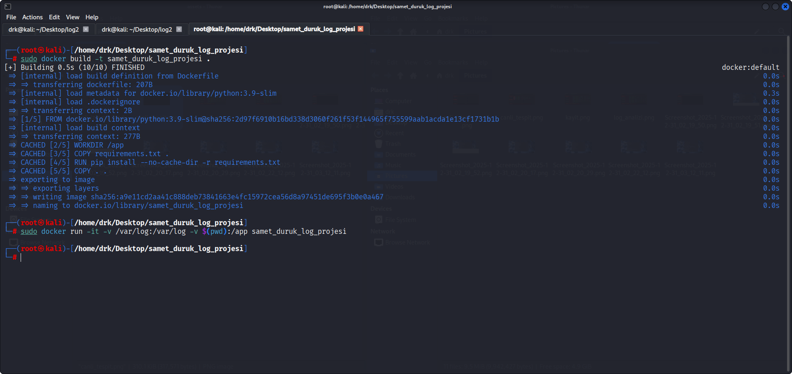
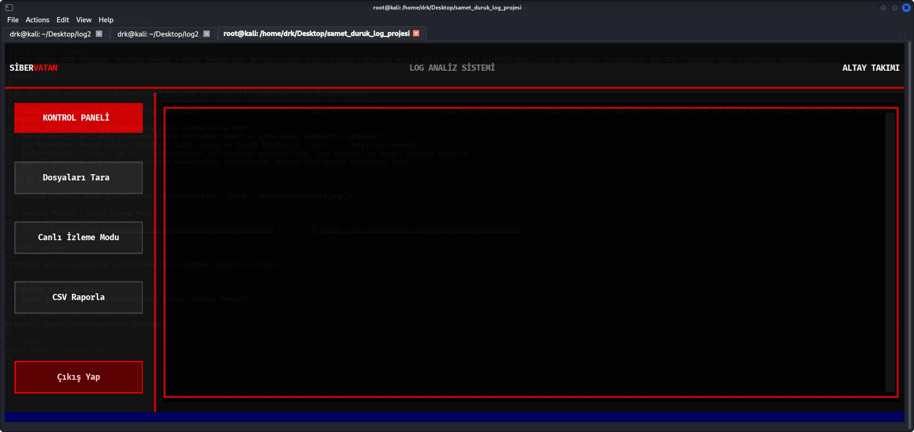
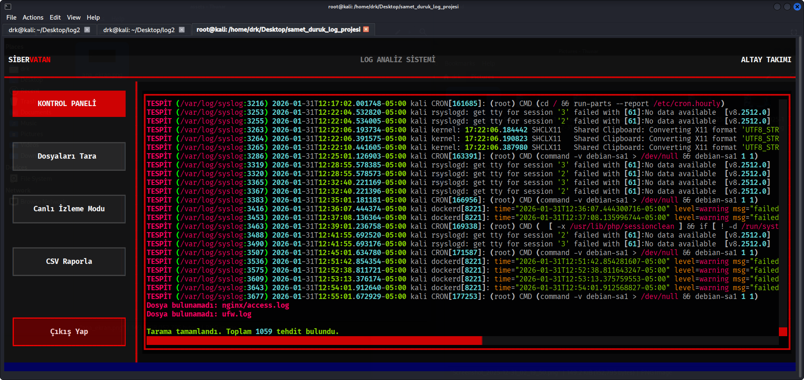
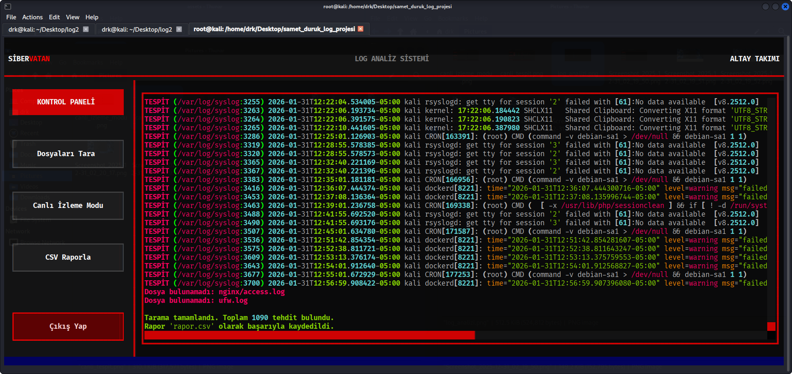
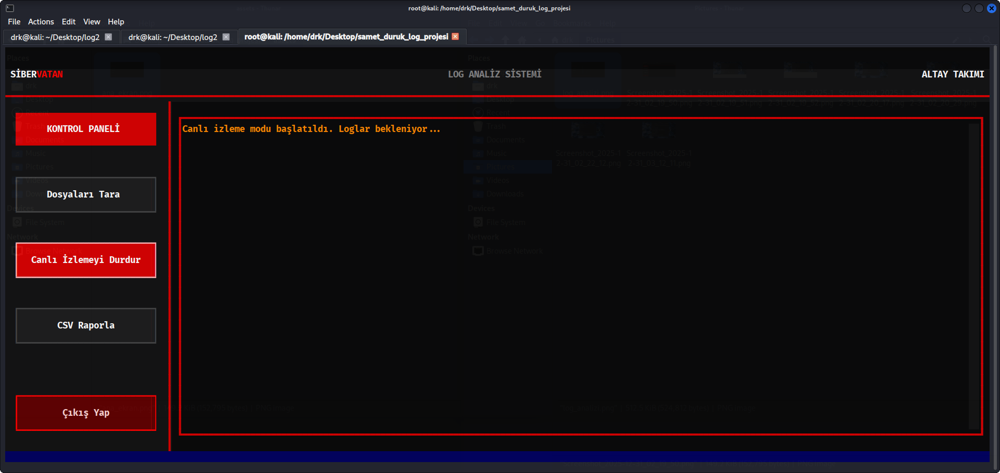
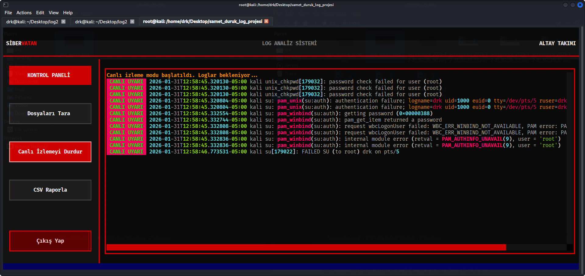

#Log Analiz Sistemi
Siber Vatan-2025 Programı Takımlar Dönemi - Altay Takımı için geliştirilmiş, Linux sistem loglarını analiz edip tehditleri görüntüleyen, canlı log akışını izleyebilen bir TUI (Terminal User Interface) aracıdır.

#Özellikler

Bu araç, SOC analistlerinin terminalden çıkmadan hızlı analiz yapabilmesi için tasarlanmıştır:

- Statik Log Taraması: Belirtilen log dosyalarını (`auth.log`, `syslog` vb.) tarar ve `failed`, `error`, `sudo` gibi anahtar kelimelerle logları analiz eder. Bu anahtar kelimeleri ve log dosya tür/yollarını settings.json dosyasından değiştirebilirsiniz.
- Canlı İzleme Modu : Log dosyalarını anlık olarak takip eder.
- Görsel Uyarı: Canlı akış sırasında kritik kelimeler renkli ve yanıp sönen efektlerle vurgulanır.
- CSV Raporlama: Tespit edilen tehditleri tarih, dosya ve içerik bilgisiyle `rapor.csv` dosyasına kaydeder.
- Modern Arayüz: `Textual` ve `Rich` kütüphaneleri kullanılarak geliştirilmiş, fare destekli ve renkli arayüze sahiptir.
- Güvenli Gösterim: Log yollarındaki özel karakterleri temizleyerek (escape ile) arayüz hatalarını önler.

#Ekran Görüntüleri

#Kurulum

Projeyi çalıştırmak için aşağıdaki adımları izlemelisiniz:

* Gereksinimler
- Python 3.8 veya üzeri
- Linux İşletim Sistemi

* Kütüphanelerin Yüklenmesi
- pip install textual rich

# Ayarlar (Opsiyonel)
Proje dizininde settings.json dosyası oluşturarak taranacak dosyaları özelleştirebilirsiniz.

#Docker ile Çalıştırma
Projeyi doğrudan Docker konteyneri içinde izole bir şekilde çalıştırabilirsiniz.

* Docker İmajını Oluşturma:
Terminali proje dizininde açın ve aşağıdaki komutu yazarak projeyi derleyin.
 - "sudo docker build -t samet_duruk_log_projesi ."
 
* Konteyneri Başlatma
Uygulamanın ana makinedeki log dosyalarını okuyabilmesi için /var/log dizinini içeri aktararak (mount) çalıştırın:
 - "sudo docker run -it --rm \
  -v /var/log:/var/log \
  -v $(pwd):/app \
  samet_duruk_log_projesi"

- -v /var/log:/var/log: Konteynerin, gerçek bilgisayarınızdaki logları okumasını sağlar.
- -v $(pwd):/app: Rapor oluştuğunda (rapor.csv), dosyanın kaybolmamasını ve proje klasörünüze kaydedilmesini sağlar.  

#Manuel Kullanım
Eğer Docker kullanmıyorsanız, uygulama /var/log altındaki sistem dosyalarını okuyacağı için root yetkisi ile çalıştırılmalıdır. 
 -"sudo python3 main.py"
 
 
#Kontrol Paneli
- Dosyaları Tara: Geçmişe dönük statik taramayı başlatır.

- Canlı İzleme Modu: Anlık takibi açar. Buton kırmızıya döner ve tekrar basıldığında izlemeyi durdurur.

- CSV Raporla: Tespitleri dışa aktarır (rapor.csv).

- Çıkış: Uygulamayı güvenli şekilde kapatır.

#Proje Yapısı

.
├── main.py          # Ana uygulama kodu
├── Dockerfile       # Docker yapılandırma dosyası
├── settings.json    # Ayar dosyası
├── rapor.csv        # Oluşturulan rapor çıktısı
├── assets/          # Ekran görüntüleri klasörü
│   ├── docker.png
│   ├── ana_ekran.png
│   ├── log_analizi.png
│   ├── kayit.png
│   ├── canli_izleme_modu.png
│   └── canli_tespit.png
└── README.md        # Proje dokümantasyonu

#Geliştirici: 
-Samet Duruk
